# Кубок Большого Слэма

### Платформа для проведения командных турниров поэзии

> Презентация для оргкомитета Москвы · 2026-05-17
> Сайт: **[grandslamcup.letar.best](https://grandslamcup.letar.best)**

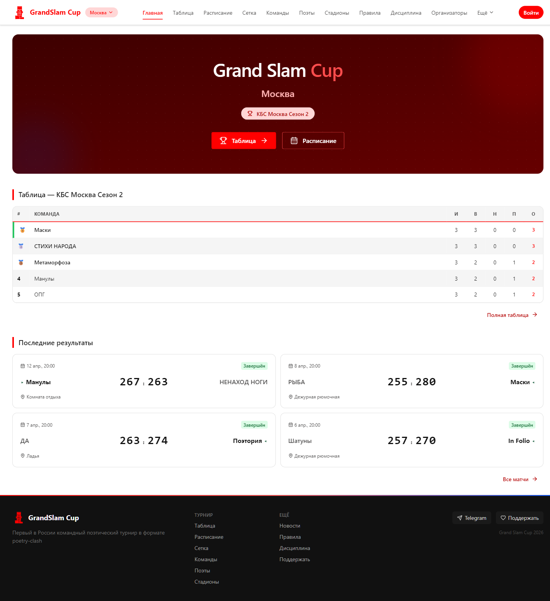

---

## О платформе

**Кубок Большого Слэма (КБС)** — это веб-приложение для проведения командных поэтических турниров в формате poetry-clash. Платформа полностью покрывает жизненный цикл турнира: от заявок и составов до live-судейства на площадке и публикации итогов.

- **Города-участники.** Санкт-Петербург (Round-Robin) — действующий пилот. Москва — масштабирование на Swiss System + Double Elimination.
- **Тип приложения.** PWA (Progressive Web App) — работает офлайн на смартфонах судей и счетоводов, добавляется на главный экран как обычное приложение.
- **Доступ.** Открытый для зрителей, единый вход (SSO «Ключница») для поэтов, тренеров, организаторов и админов.
- **Аудитория.** Поэты, тренеры, жюри, ведущие, скореры (счетоводы), организаторы города, администраторы платформы, зрители на сайте и в зале.

---

## Ключевые цифры

| Метрика                            | Значение                                                     |
| ---------------------------------- | ------------------------------------------------------------ |
| Реализованных страниц              | **90+**                                                      |
| Доменных моделей данных            | **31**                                                       |
| Ролей пользователей                | **8**                                                        |
| Турнирных форматов                 | **2** (Round-Robin · Swiss + Double Elimination)             |
| Шагов Wizard живого скоринга матча | **11**                                                       |
| Судей на матч                      | **5** × 2 тайма = **10**                                     |
| E2E-тестов на Playwright           | **28**                                                       |
| Релизных версий                    | **3.30+**                                                    |
| Стек                               | Next.js 16 · React 19 · Chakra UI v3 · PostgreSQL · ZenStack |

---

## Архитектура ролей и доступа

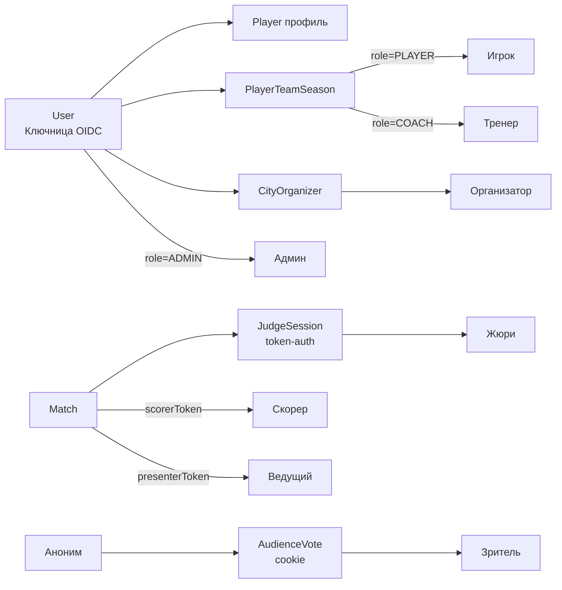
```mermaid
graph LR
  U[User<br/>Ключница OIDC] --> P[Player профиль]
  U --> PTS[PlayerTeamSeason]
  PTS -->|role=PLAYER| Игрок
  PTS -->|role=COACH| Тренер
  U --> CO[CityOrganizer]
  CO --> Организатор
  U -->|role=ADMIN| Админ
  M[Match] --> JS[JudgeSession<br/>token-auth] --> Жюри
  M -->|scorerToken| Скорер
  M -->|presenterToken| Ведущий
  Аноним --> AV[AudienceVote<br/>cookie] --> Зритель
```

Один человек может одновременно быть игроком одной команды, тренером другой, организатором города и админом платформы — права складываются.

---

## Возможности по ролям

### Для зрителя (без регистрации)

- **Турнирная таблица** в реальном времени с разницей очков и группировкой по лигам.
- **Расписание матчей** с **iCal-экспортом** одной кнопкой в Google / Apple / Outlook календарь.
- **Профили команд** — состав, домашняя площадка, история матчей, статистика побед/поражений.
- **Профили поэтов** — биография, фото, соцссылки, лучшие выступления, опубликованные стихи.
- **Рейтинг поэтов** по среднему баллу: медали топ-3, фильтры по сезону / городу / команде.
- **Площадки** на Яндекс.Карте с маркерами и фильтрацией по городу.
- **Новости и обзоры матчей** с обложками и Markdown-вёрсткой.
- **Зрительское голосование** — «народное жюри»: любой человек со смартфона ставит 1–5 за текст и подачу, статистика показывается рядом с официальными оценками (не влияет на результат).
- **Экран проектора** — огромный счёт во весь экран зала с переключением в fullscreen.

#### Турнирная таблица сезона

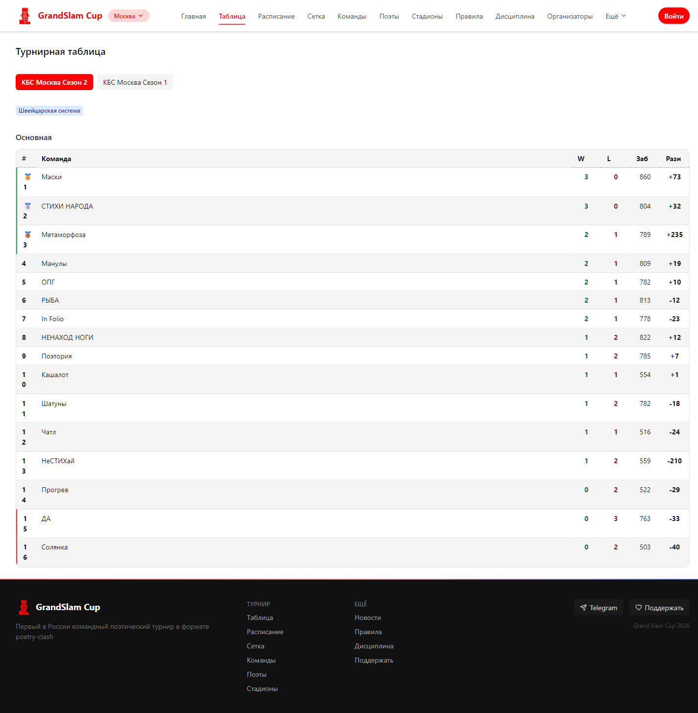

#### Расписание матчей

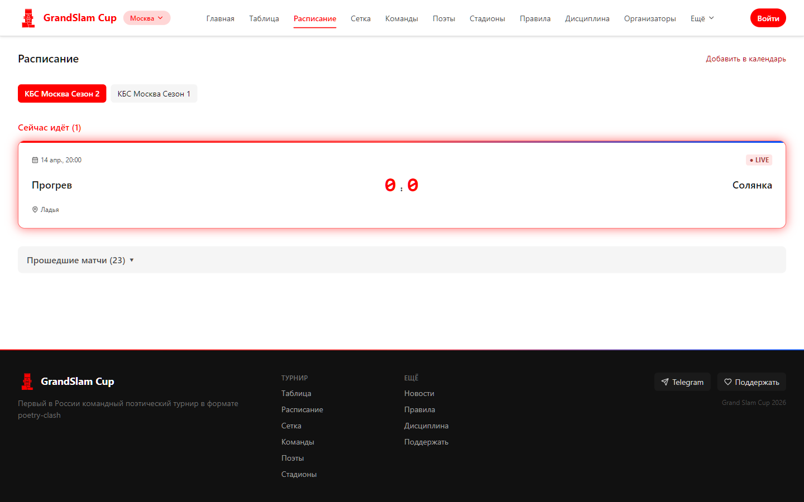

#### Турнирная сетка плей-офф

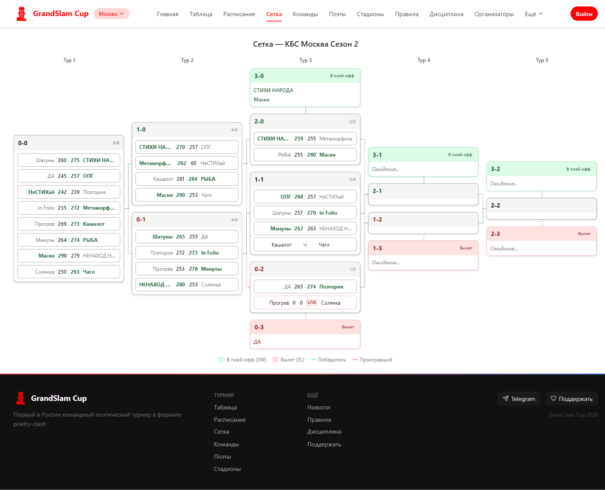

#### Список команд и поэтов

| Команды                                     | Рейтинг поэтов                                     |
| ------------------------------------------- | -------------------------------------------------- |
| 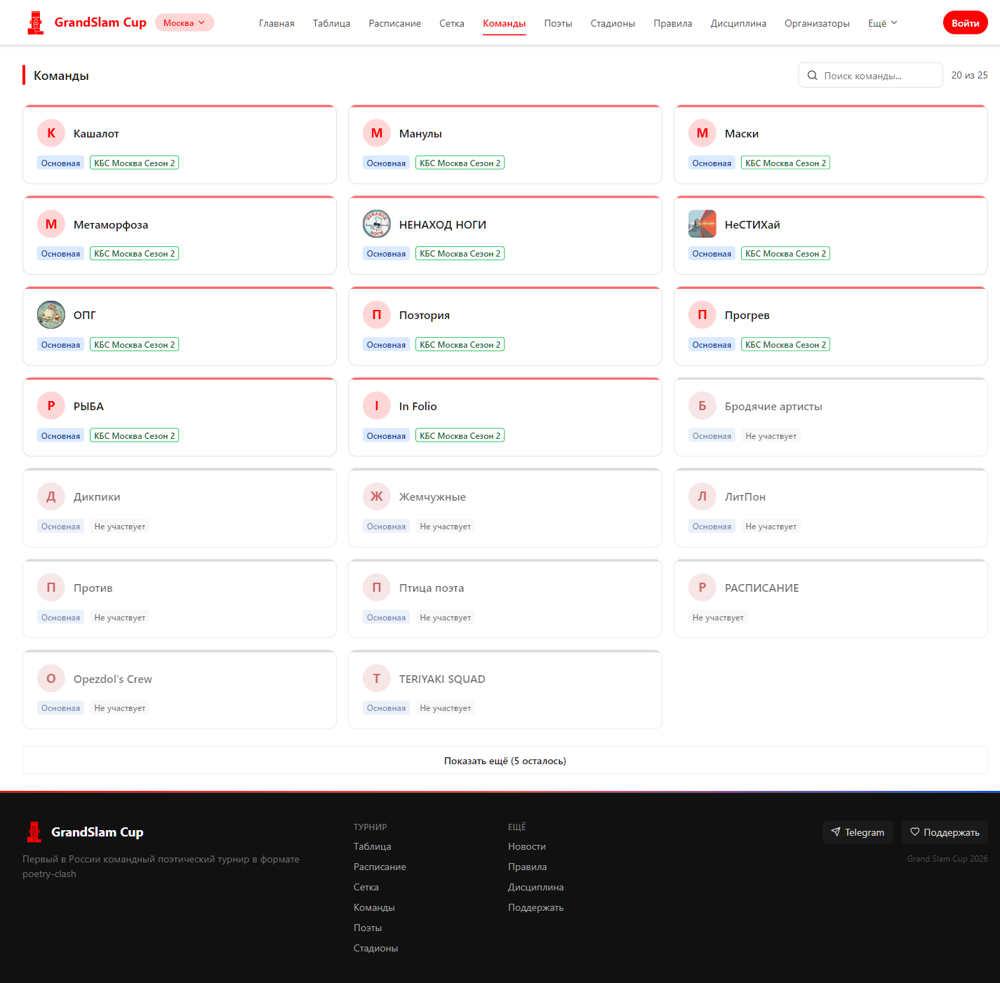 | 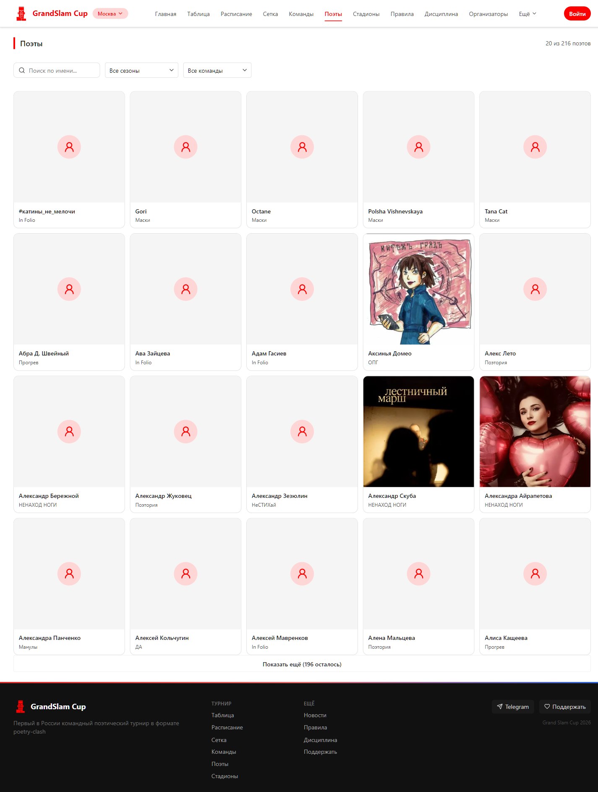 |

#### Профиль команды «Маски»

Эмблема, состав из десятков поэтов, история матчей и привязка к домашней площадке.

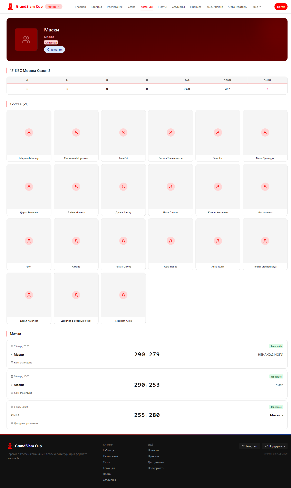

#### Профиль поэта (Александра Айрапетова)

Биография, фото, соцссылки, **карьера по сезонам**, командная принадлежность, история всех 9 выступлений с конкретными оценками текста и подачи по парам.

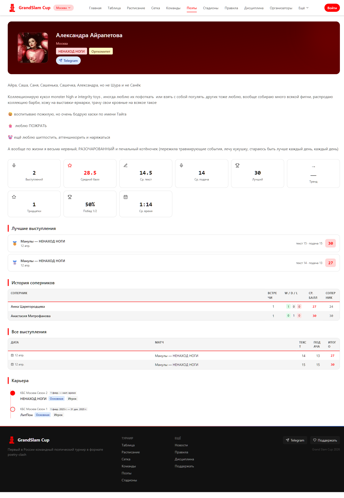

#### Завершённый матч: Маски 290 : 279 НЕНАХОД НОГИ

Карточка результата с составами обеих команд, итоговым счётом, победным стихотворением, фото-галереей. Ссылки на детальный протокол, голосование зрителей и live-режим.

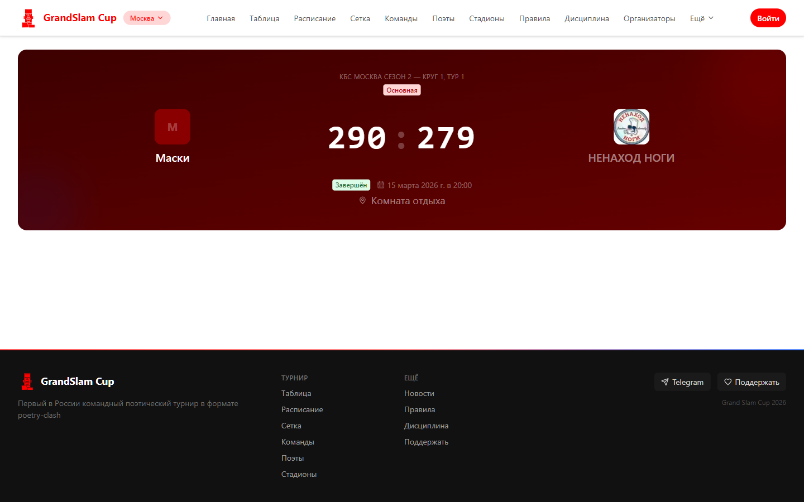

#### Детальный протокол матча

Печатный протокол пара-за-парой: какой поэт против какого, оценки текста и подачи от каждого судьи, итоговая сумма с отброшенными max/min, накопительный счёт после каждой пары.

#### Экран проектора и народное жюри

Слева — то, что видит зал на большом экране (огромный счёт, fullscreen). Справа — то, что видит зритель на своём смартфоне (1–5 за текст и подачу, не влияет на результат).

| Проектор зала                                       | Народное жюри (со смартфона)                       |
| --------------------------------------------------- | -------------------------------------------------- |
|  | 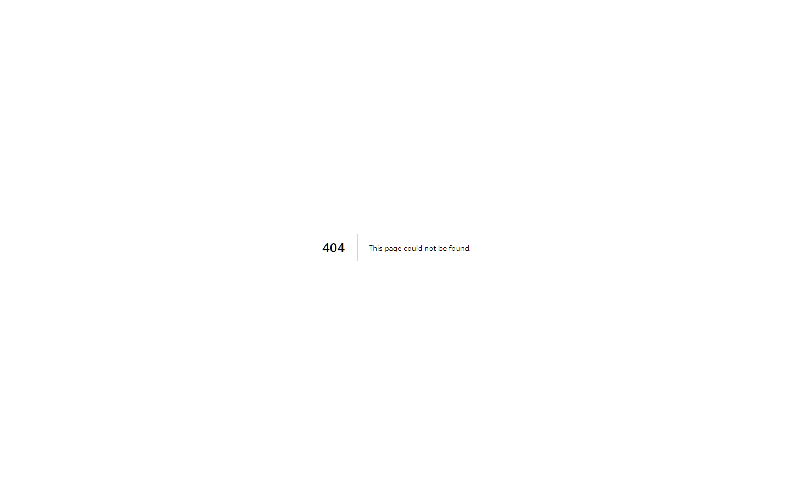 |

#### Стихи поэта

На странице поэта — список опубликованных стихотворений с обложками. Клик по любому открывает полную страницу стиха с сохранёнными переносами строк, автором и контекстом турнирной карьеры.

| Профиль с подборкой стихов                                        | Страница стиха                                  |
| ----------------------------------------------------------------- | ----------------------------------------------- |
| 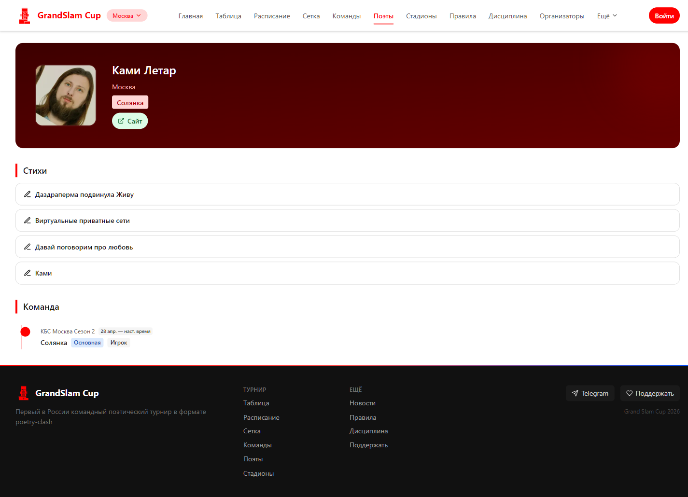 | 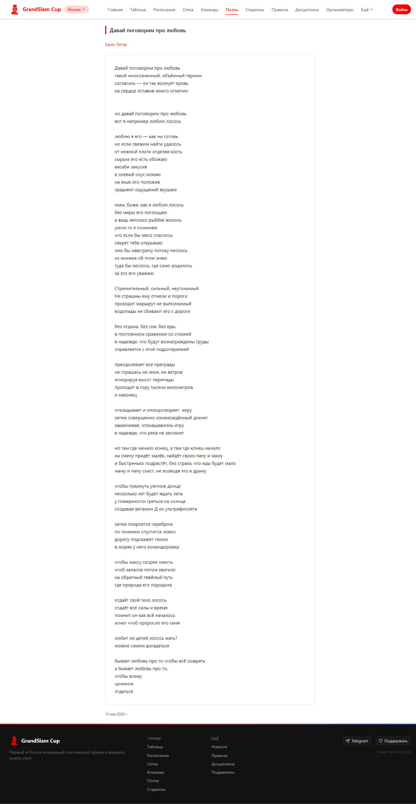 |

#### Площадки на карте, дисциплина и оргкомитет

| Площадки на Яндекс.Карте                          | Активные отстранения                          | Оргкомитет КБС                               |
| ------------------------------------------------- | --------------------------------------------- | -------------------------------------------- |
| 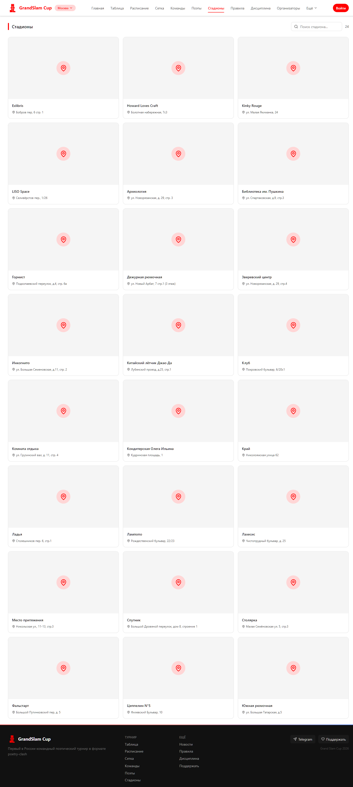 | 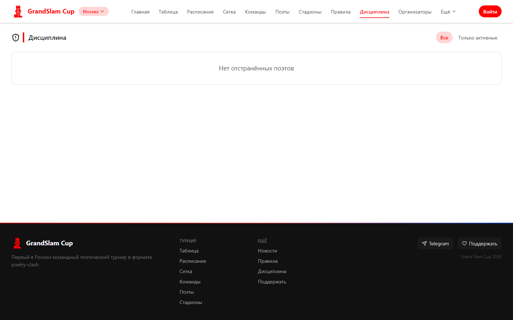 | 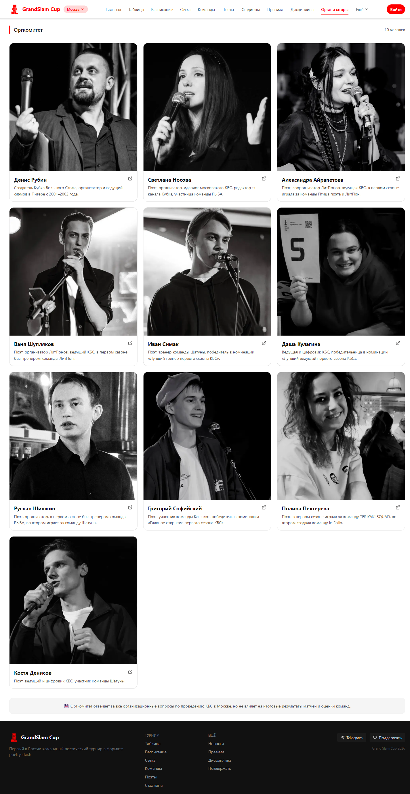 |

### Для поэта (Player)

- Личный кабинет: редактирование имени, фото, биографии, соцссылок (Telegram, VK, YouTube, Instagram, сайт).
- **Публикация стихов**: текст с сохранением переносов, обложка, статус «опубликовано / черновик».
- История собственных выступлений по сезонам со ссылками на матчи.
- Привязка профиля к турнирному аккаунту (Player ↔ User через Ключницу).
- **В разработке (Фаза 8):** альбомы стихов с обложками, плитка «Разное» для стихов без альбома.

### Для тренера команды (Coach)

- **Дашборд** команды: профиль, состав, ближайшие матчи.
- **Управление составом**: заявки на новых игроков, трансферы (модерируются админом).
- **Линап на матч** — за 6 часов до матча отбор 5–8 игроков с явным порядком выхода.
- **Управление заменами** во время матча (максимум 2 замены во втором тайме).
- **Товарищеские матчи**: вызов соперникам, согласование даты и площадки.
- **История матчей** со статусами поданных заявок.

### Для жюри (Judge)

- **Регистрация по QR-коду** на экране скорера — без создания аккаунта.
- Цветовая идентификация (RED, BLUE, GREEN, YELLOW, PURPLE) для зрителей и камер.
- **Голосование за текст и подачу** по шкале 1–5 — крупные кнопки, mobile-first.
- **Свежий состав жюри** на каждый тайм (5 + 5 = 10 разных судей).
- **Защита от повторов**: cookie-fingerprint за 30 дней — скорер видит предупреждение, если устройство уже голосовало в этом сезоне.

### Для скорера (счетовода)

- Доступ по токен-ссылке без регистрации — ссылка раздаётся админом.
- **11-шаговый Wizard ведения матча** — пошаговый интерфейс с защитой от случайных действий.

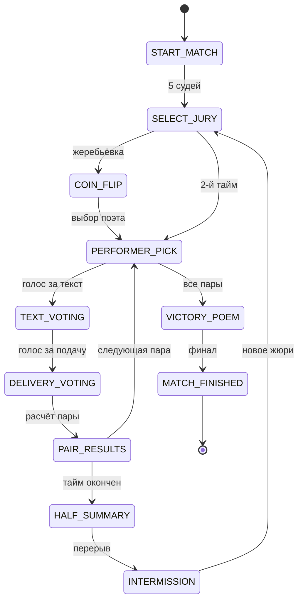
```mermaid
stateDiagram-v2
  [*] --> START_MATCH
  START_MATCH --> SELECT_JURY: 5 судей
  SELECT_JURY --> COIN_FLIP: жеребьёвка
  COIN_FLIP --> PERFORMER_PICK: выбор поэта
  PERFORMER_PICK --> TEXT_VOTING: голос за текст
  TEXT_VOTING --> DELIVERY_VOTING: голос за подачу
  DELIVERY_VOTING --> PAIR_RESULTS: расчёт пары
  PAIR_RESULTS --> PERFORMER_PICK: следующая пара
  PAIR_RESULTS --> HALF_SUMMARY: тайм окончен
  HALF_SUMMARY --> INTERMISSION: перерыв
  INTERMISSION --> SELECT_JURY: новое жюри
  SELECT_JURY --> PERFORMER_PICK: 2-й тайм
  PERFORMER_PICK --> VICTORY_POEM: все пары
  VICTORY_POEM --> MATCH_FINISHED: финал
  MATCH_FINISHED --> [*]
```

- **Real-time прогресс жюри** через SSE: видно «3 / 5 проголосовали», подсветка просроченных судей через 60 сек.
- **Таймер выступления** 3 минуты — зелёный → жёлтый (2:30) → красный (3:00) с вибрацией.
- **Карточки нарушений** (жёлтые / красные) с типизированными причинами: овертайм, пение, агрессия, незаявленный дисс, плагиат и др.
- **Оффлайн-предзагрузка** матча — продолжает работать при потере связи.

### Для ведущего (Presenter)

- Компактный экран управления процессом — отмена голосования, ручной запуск, таймер.
- Связь со скорером в реальном времени.

### Для тренера на матче (Coach screen)

- Отдельный экран с собственным токеном.
- Просмотр состава, замены, real-time счёт по парам.

### Для администратора

- **Справочники**: города, площадки, команды (с логотипами), поэты (с поиском и объединением дубликатов), пользователи.
- **Управление сезонами**: формат, трансферное окно, число замен, разрешение ничьих, домашние стадионы, показ live-счёта.
- **Этапы и раунды**: GROUP, PLAYOFF_UPPER, PLAYOFF_LOWER, GRAND_FINAL — генерируются автоматически.
- **Генерация турнирной сетки одной кнопкой**:
  - Swiss-раунды с проверкой повторов и автоматическими «bye»
  - Double Elimination на 16 команд (15 матчей в Upper Bracket, 7 в Lower)
- **Модерация**: заявки на новых игроков, трансферы, товарищеские матчи, обращения о плагиате.
- **Новости и доноры** с привязкой к городу.
- **Аналитика**: «щедрость» судей, разброс оценок, дублирующиеся устройства, графики по сезонам.
- **Telegram-интеграции**: логи webhook'ов, статистика отправленных сообщений.
- **Отстранения игроков**: красные карточки, накопление 5 жёлтых, плагиат — с возможностью пропуска N матчей или до конца сезона.

---

## Турнирная логика

### Иерархия турнирных сущностей

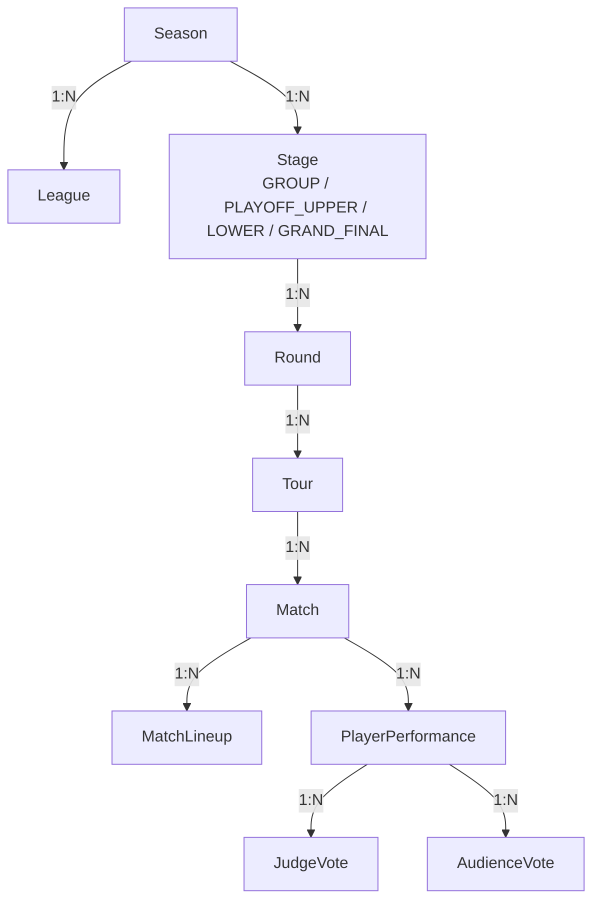
```mermaid
graph TD
  Season -->|1:N| League
  Season -->|1:N| Stage[Stage<br/>GROUP / PLAYOFF_UPPER / LOWER / GRAND_FINAL]
  Stage -->|1:N| Round
  Round -->|1:N| Tour
  Tour -->|1:N| Match
  Match -->|1:N| Lineup[MatchLineup]
  Match -->|1:N| Performance[PlayerPerformance]
  Performance -->|1:N| JudgeVote
  Performance -->|1:N| AudienceVote
```

### Форматы турниров

| Формат                 | Город              | Структура                                                 |
| ---------------------- | ------------------ | --------------------------------------------------------- |
| **Round-Robin**        | СПб                | Каждый с каждым 1–2 раза, очки 1 / 0.5 / 0                |
| **Swiss System**       | Москва (групповой) | Пары по W-L записи, проверка повторов, авто-bye           |
| **Double Elimination** | Москва (плей-офф)  | Upper Bracket + Lower Bracket + Grand Final, на 16 команд |

### Расчёт оценки выступления

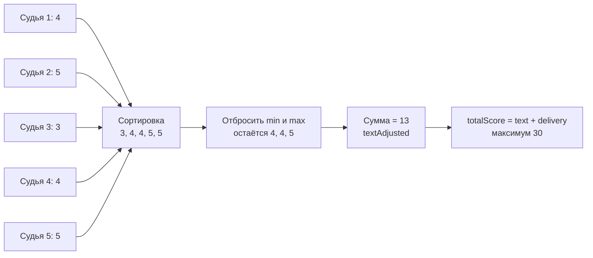
```mermaid
flowchart LR
  J1[Судья 1: 4] --> SORT
  J2[Судья 2: 5] --> SORT
  J3[Судья 3: 3] --> SORT
  J4[Судья 4: 4] --> SORT
  J5[Судья 5: 5] --> SORT
  SORT[Сортировка<br/>3, 4, 4, 5, 5] --> DROP[Отбросить min и max<br/>остаётся 4, 4, 5]
  DROP --> SUM[Сумма = 13<br/>textAdjusted]
  SUM --> TOTAL[totalScore = text + delivery<br/>максимум 30]
```

- 5 судей оценивают **текст** и **подачу** независимо по шкале 1–5.
- Отбрасываются максимум и минимум — остаются 3 средние оценки → сумма.
- Текст (макс 15) + Подача (макс 15) = **totalScore до 30 баллов**.
- Сумма выступлений всех поэтов команды = счёт команды.
- При ничьей: либо 0.5:0.5 (если разрешено сезоном), либо **tiebreak** — 11-я пара поэтов.

### Антифрод

- **Cookie-fingerprint судей** за 30 дней — предупреждение скореру при повторе устройства.
- **Уникальный ключ голоса** на уровне БД: одно устройство = один голос за одно выступление.
- **Зрительское голосование** анонимное (sessionToken), физически не влияет на результат — параллельная статистика «народного жюри».

---

## Архитектура и качество

| Слой              | Технология                                                         |
| ----------------- | ------------------------------------------------------------------ |
| Фреймворк         | **Next.js 16** (App Router), **React 19**                          |
| UI                | **Chakra UI v3**, mobile-first, dark / light                       |
| Аутентификация    | **Better Auth** + Ключница (OIDC SSO)                              |
| База данных       | **PostgreSQL 17** + **ZenStack** (политики на уровне БД)           |
| Формы и валидация | `@letar/forms` + **Zod 4**                                         |
| Состояние         | **TanStack Query** + Server Actions                                |
| Real-time         | **Server-Sent Events** (счётчики) + **Socket.IO** (live-сообщения) |
| Тестирование      | **Playwright** (28 E2E)                                            |
| Аналитика         | **Umami** (self-hosted, без cookie-баннеров)                       |
| PWA               | Service Worker, offline-страница, добавление на главный экран      |
| Деплой            | **Docker** + Nginx Proxy Manager, выделенный сервер `s2`           |
| Резервные копии   | Ежедневный pg_dump БД + uploads, retention 30 дней                 |

**Ключевые преимущества стека для оргкомитета:**

- ✅ **Безопасность на уровне БД** — ZenStack-политики гарантируют, что черновик стиха или личное сообщение физически не могут утечь к чужому пользователю.
- ✅ **Работает в зале без интернета** — PWA-приложение кэшируется в браузере судьи, голосование продолжается даже при падении Wi-Fi.
- ✅ **Мобильная адаптивность** — все экраны проектируются «сначала под смартфон».
- ✅ **Поддержка крупных турниров** — структура БД и алгоритмы рассчитаны на 16+ команд и десятки матчей в сезоне.

---

## В активной разработке (ближайшие 1–2 месяца)

### Альбомы стихов (Фаза 8)

Поэт сможет объединять свои стихи в именованные альбомы с обложкой:

- Сетка квадратных постеров на профиле поэта (до 4 альбомов + плитка «Все альбомы» + плитка «Разное» для стихов вне альбома).
- Отдельная страница альбома с hero-обложкой и нумерованным списком стихов.
- Управление альбомами в личном кабинете, загрузка обложек с автоматической оптимизацией.
- ✅ ТЗ полностью описано, готово к разработке.

### Встроенные чаты (Фаза 9 — **новое предложение для оргкомитета**)

10 типов чатов внутри платформы, привязанных к турнирным сущностям:

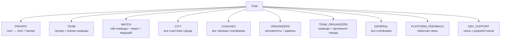
```mermaid
graph TD
  Chat --> PRIVATE[PRIVATE<br/>поэт ↔ поэт / тренер]
  Chat --> TEAM[TEAM<br/>тренер + игроки команды]
  Chat --> MATCH[MATCH<br/>обе команды + жюри + ведущий]
  Chat --> CITY[CITY<br/>все участники города]
  Chat --> COACHES[COACHES<br/>все тренеры платформы]
  Chat --> ORGANIZERS[ORGANIZERS<br/>оргкомитеты + админы]
  Chat --> TEAM_ORG[TEAM_ORGANIZERS<br/>команда + оргкомитет города]
  Chat --> GENERAL[GENERAL<br/>вся платформа]
  Chat --> FEEDBACK[PLATFORM_FEEDBACK<br/>обратная связь]
  Chat --> DEV[DEV_SUPPORT<br/>связь с разработчиком]
```

- **Real-time доставка** через WebSocket, индикатор «набирает текст», онлайн-статус.
- **Push, email и Telegram-уведомления** — каждый пользователь сам выбирает каналы.
- **Реакции эмодзи, цитирование, редактирование и удаление** своих сообщений.
- **Эталонная реализация уже отлажена** в братском проекте `driving-school` — копируется готовая архитектура (4 модели БД, 22 UI-компонента, 21 server action).
- Срок разработки: **~3–4 недели**.

### Самоорганизация товарищеских матчей: биржа счетоводов и ведущих (Фаза 15)

Сейчас для проведения товарищеского матча нужен администратор — он вручную назначает счетовода и ведущего. **Фаза 15** убирает этот bottleneck: тренер проходит весь путь самостоятельно, система автоматически рассылает токены.

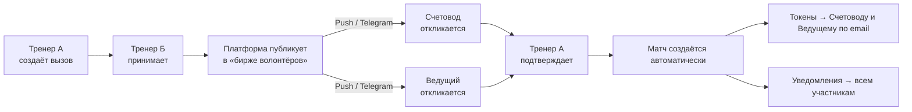
```mermaid
flowchart LR
  A[Тренер А<br/>создаёт вызов] --> B[Тренер Б<br/>принимает]
  B --> PUB[Платформа публикует<br/>в «бирже волонтёров»]
  PUB -->|Push / Telegram| V1[Счетовод<br/>откликается]
  PUB -->|Push / Telegram| V2[Ведущий<br/>откликается]
  V1 --> CONF[Тренер А<br/>подтверждает]
  V2 --> CONF
  CONF --> READY[Матч создаётся автоматически]
  READY --> TOKENS[Токены → Счетоводу и Ведущему по email]
  READY --> NOTIF[Уведомления → всем участникам]
```

**Биржа волонтёров** — страница `/volunteer` со списком зарегистрированных счетоводов и ведущих по городам:

| Поле      | Описание                                   |
| --------- | ------------------------------------------ |
| Рейтинг ★ | Средняя оценка тренеров после матчей (1–5) |
| Роль      | 📊 Счетовод / 🎙️ Ведущий / оба              |
| Статус    | «Принимаю запросы» / «Занят»               |
| История   | Сколько матчей провёл                      |

**После матча** оба тренера оценивают работу счетовода и ведущего — рейтинг накапливается, лучшие волонтёры получают признание.

- **Полная автономность** — администратор не требуется на протяжении всего флоу.
- **Уведомления на каждом шаге** — Push + email + Telegram для всех участников.
- **Авто-создание матча** при подтверждении волонтёров: токены рассылаются мгновенно.
- Срок разработки: **~2–3 недели**.

### Планирование тренировок команды (Фаза 10)

Тренер собирает команду между матчами без созвонов в Telegram:

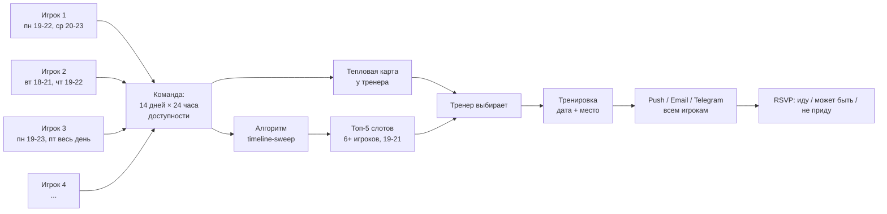
```mermaid
flowchart LR
  P1[Игрок 1<br/>пн 19-22, ср 20-23] --> AVAIL[Команда:<br/>14 дней × 24 часа<br/>доступности]
  P2[Игрок 2<br/>вт 18-21, чт 19-22] --> AVAIL
  P3[Игрок 3<br/>пн 19-23, пт весь день] --> AVAIL
  P4[Игрок 4<br/>...] --> AVAIL
  AVAIL --> HEAT[Тепловая карта<br/>у тренера]
  AVAIL --> ALGO[Алгоритм<br/>timeline-sweep]
  ALGO --> TOP5[Топ-5 слотов<br/>6+ игроков, 19-21]
  HEAT --> COACH[Тренер выбирает]
  TOP5 --> COACH
  COACH --> SESSION[Тренировка<br/>дата + место]
  SESSION --> NOTIF[Push / Email / Telegram<br/>всем игрокам]
  NOTIF --> RSVP[RSVP: иду / может быть / не приду]
```

- **Игрок** размечает свободные слоты на 14 дней вперёд: календарная сетка дни × часы, drag-to-select.
- **Тренер** видит тепловую карту доступности всей команды + **топ-5 предложенных системой** оптимальных слотов: «6 игроков свободны 21 мая с 19:00 до 22:00 — Денис, Светлана, Александра, Ваня, Иван, Даша».
- **Алгоритм** учитывает: количество свободных игроков (приоритет №1), близость к «уютному» времени 19–21 (приоритет №2), отдалённость от матчей (приоритет №3).
- **Один клик** на предложении → тренировка создана + приглашения разосланы push / email / Telegram.
- **RSVP**: каждый отвечает «иду / может быть / не приду», тренер видит реальный состав.
- **Напоминания** автоматически за 24 ч и 2 ч до тренировки. Тренировки экспортируются в iCal-календарь вместе с матчами.
- Срок разработки: **~2 недели**.

### Видео матчей и каналы поэтов / команд (Фаза 11)

Раскрывает зрелищность турнира — каждое выступление можно пересмотреть, поделиться, разобрать.

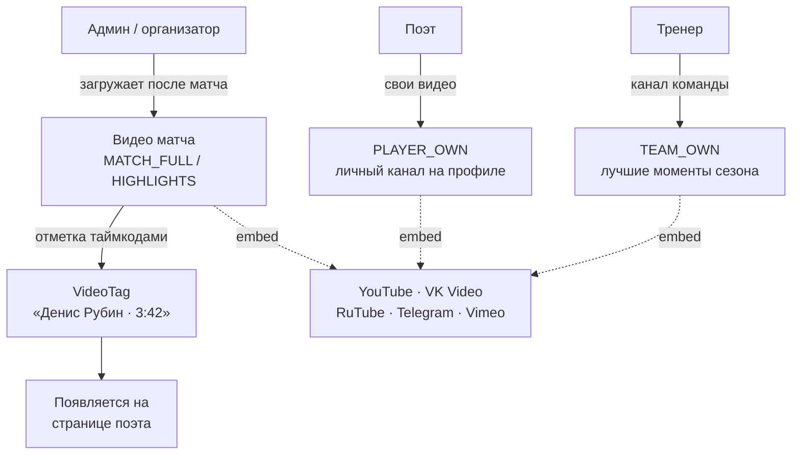
```mermaid
graph TD
  ADMIN[Админ / организатор] -->|загружает после матча| MATCH_VID[Видео матча<br/>MATCH_FULL / HIGHLIGHTS]
  MATCH_VID -->|отметка таймкодами| TAG[VideoTag<br/>«Денис Рубин · 3:42»]
  TAG --> PLAYER_PAGE[Появляется на<br/>странице поэта]
  POET[Поэт] -->|свои видео| OWN_PLAYER[PLAYER_OWN<br/>личный канал на профиле]
  COACH[Тренер] -->|канал команды| OWN_TEAM[TEAM_OWN<br/>лучшие моменты сезона]
  MATCH_VID -.->|embed| PROVIDERS[YouTube · VK Video<br/>RuTube · Telegram · Vimeo]
  OWN_PLAYER -.->|embed| PROVIDERS
  OWN_TEAM -.->|embed| PROVIDERS
```

- **Видео с матчей**: организатор после игры вставляет URL с YouTube / VK Video / RuTube / Telegram / Vimeo — система автоматически парсит обложку, длительность, делает responsive embed.
- **Отметка поэтов**: админ или тренер размечает таймкодами, какой поэт где выступает. На профиле поэта видео появляется автоматически с прямой ссылкой на нужный фрагмент.
- **Личный канал поэта**: на своей странице каждый поэт сам публикует видео — выступления с других площадок, клипы, демо. Раздел «Видео» на профиле.
- **Канал команды**: тренер ведёт командный канал — «лучшее за сезон», бэкстейдж, промо.
- **Короткие клипы** (≤ 60 сек) можно загружать прямо на платформу — для «хайлайтов» матча без зависимости от YouTube.
- **SEO-бонус**: структурированные данные `VideoObject` + `og:video` дают красивые превью при шеринге в Telegram / VK / WhatsApp.
- **Модерация**: жалобы на видео, whitelist провайдеров (нельзя вставить произвольную ссылку), rate-limit от спама.
- Срок разработки: **~2–3 недели** (без native upload — он опционально).

### Telegram Mini App — КБС прямо внутри Telegram (Фаза 14)

Telegram Mini App (TMA) — это веб-приложение, встроенное в мессенджер. Пользователь не скачивает ничего: бот отправляет сообщение в канал с кнопкой «Открыть» — и поэт / зритель / судья попадает в полноценный интерфейс платформы, не выходя из Telegram.

```mermaid
graph LR
  CH[Telegram-канал<br/>@bigpoetryslam_msk] -->|Анонс матча| BTN[Кнопка «Live-счёт»]
  BTN --> TMA[Telegram Mini App<br/>grandslamcup.letar.best/tma/]
  TMA --> LIVE[Live-счёт матча<br/>обновляется в реальном времени]
  TMA --> VOTE[Зрительское голосование<br/>без регистрации]
  TMA --> STAND[Турнирная таблица]
  TMA --> SCHED[Расписание + .ics в календарь]
  TMA --> PROF[Профиль поэта + стихи]
  TMA --> JURY[Жюри по deep link<br/>вместо QR-кода]
  TMA -->|авторизация| AUTH[Telegram initData<br/>без пароля / Ключницы]
```

**Ключевые экраны TMA:**

| Экран                     | URL                    | Кто открывает                        |
| ------------------------- | ---------------------- | ------------------------------------ |
| Live-счёт матча           | `/tma/match/[id]`      | Зрители из канала по кнопке в анонсе |
| Зрительское голосование   | `/tma/match/[id]/vote` | Зрители во время матча               |
| Турнирная таблица         | `/tma/standings`       | Все                                  |
| Расписание                | `/tma/schedule`        | Поэты, болельщики                    |
| Профиль поэта             | `/tma/player/[slug]`   | Все                                  |
| Вход для жюри (deep link) | `/tma/jury?token=xxx`  | Судьи — QR заменяется ссылкой в боте |

**Преимущества перед PWA и Android:**

- **Нулевой порог входа** — Telegram уже установлен у 100% участников.
- **Авторизация одним тапом** — `initData.user` приходит автоматически, пользователь ничего не вводит.
- **Haptic Feedback** — вибрация при голосовании и подтверждении действий.
- **Нативный back gesture** — кнопка «Назад» в шапке Telegram.
- **Тёмная/светлая тема** — TMA автоматически подхватывает системную тему Telegram.
- **Срок реализации MVP: 1–2 недели** (существующий PWA оборачивается в TMA-layout, добавляется route-группа `/tma/`).

---

### Android-приложение для поэтов, тренеров и организаторов (Фаза 12)

PWA удобна зрителю в зале, но активные роли — поэт, тренер, организатор — заслуживают полноценного нативного опыта: надёжные push, иконка на экране, системные камера и галерея, биометрический вход, deep links из Telegram.

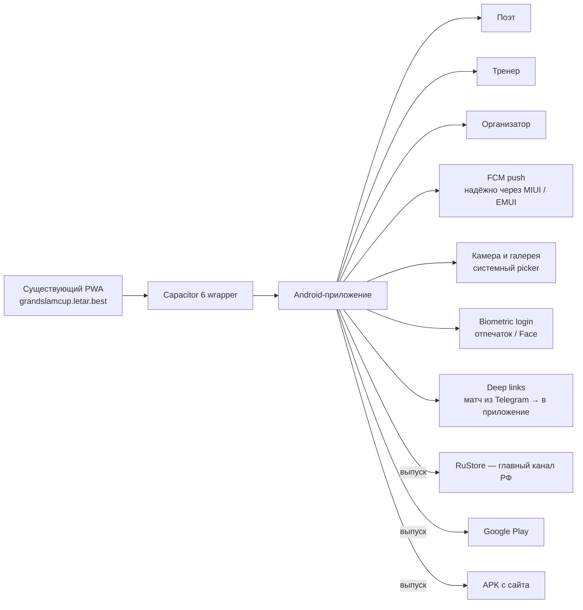
```mermaid
graph LR
  WEB[Существующий PWA<br/>grandslamcup.letar.best] --> WRAP[Capacitor 6 wrapper]
  WRAP --> NATIVE[Android-приложение]
  NATIVE --> P[Поэт]
  NATIVE --> C[Тренер]
  NATIVE --> O[Организатор]
  NATIVE --> PUSH[FCM push<br/>надёжно через MIUI / EMUI]
  NATIVE --> CAM[Камера и галерея<br/>системный picker]
  NATIVE --> BIO[Biometric login<br/>отпечаток / Face]
  NATIVE --> DEEP[Deep links<br/>матч из Telegram → в приложение]
  NATIVE -->|выпуск| RUSTORE[RuStore — главный канал РФ]
  NATIVE -->|выпуск| PLAY[Google Play]
  NATIVE -->|выпуск| APK[APK с сайта]
```

- **Ядро приложения** — три кита, без которых не выпускаем:
  1. **Полноценный чат** на уровне Telegram (свайп для reply, long-press меню, реакции, цитирование, inline-превью ссылок, pinned, поиск, прикрепление фото с камеры). Все 10 типов чатов Фазы 9 работают нативно.
  2. **Push-уведомления о сообщениях и упоминаниях** — отдельный высокоприоритетный канал FCM `mentions`, badge с числом непрочитанных на иконке приложения, **inline-ответ из шторки** без открытия приложения (Android Direct Reply).
  3. **Уведомления о тренировках и матчах** — приглашение на тренировку с кнопками «Иду / Может быть / Не приду» прямо в шторке, напоминания за 24 ч и 2 ч до тренировки/матча с открытием места в Яндекс.Картах одним тапом.
- **16 категорий push-уведомлений** разнесены по FCM Notification Channels: пользователь в системных настройках Android выключает шумные категории (новости города), оставляя важные (упоминания, тренировки, матчи). Тихие часы 22:00–08:00 настраиваются в приложении.
- **Стратегия:** Capacitor 6 оборачивает существующий PWA — 95% UI работает «as is», добавляется доступ к нативным API через 14 плагинов (push, камера, файлы, биометрия, share-sheet, vibration, secure storage, app badge, keep-awake).
- **Аутентификация:** Better Auth → токен в Android Keystore → biometric prompt при повторном запуске.
- **Push через FCM** (Firebase Cloud Messaging) — расширение существующей модели `PushSubscription` полями `fcmToken` и `platform`. Те же события (новое сообщение, приглашение на тренировку, скоро матч) приходят надёжно даже на Xiaomi / Huawei, где web-push нестабилен.
- **Deep links** через App Links: ссылка на матч из Telegram открывается прямо в приложении.
- **Не делаем сразу нативное**: Capacitor закрывает 90% потребностей за 10% усилий. Если экран жюри потребует абсолютной отзывчивости — React Native + Expo вторым этапом.
- **iOS — отдельная фаза** (Apple Developer Account, Mac для билда). Делаем после Android, по фидбеку.
- **Срок разработки этапа 1 (MVP с Capacitor): 2–3 недели.**

---

## Видение и дальнейшее развитие

### Социальный слой (после чатов)

- Лайки и комментарии под стихами поэтов.
- Подписки на любимых поэтов с push-уведомлениями о новых стихах и матчах.
- Лента активности с фотографиями и видео с матчей.

### Расширение возможностей жюри

- Видеозапись каждого выступления с привязкой к `PlayerPerformance` — для повторного просмотра и апелляций.
- Голосовые комментарии судей (опционально).
- AI-помощник для подсказок по критериям оценки (поддержка, не замена жюри).

### Спонсорство и монетизация

- Места под рекламу партнёров: баннеры на страницах сезонов и матчей, спонсорские бейджи команд.
- Платная подписка для расширенной аналитики и архивных видео.
- Краудфандинг призового фонда сезона через интеграцию с Boosty.

### Мобильные приложения

- **Telegram Mini App** — в планах (Фаза 14, см. выше). Срок MVP: 1–2 недели. Нулевой барьер входа — все участники уже в Telegram.
- **Android для активных ролей** — в планах (Фаза 12, см. выше). Capacitor 6 + FCM, RuStore / Google Play.
- **iOS-версия** — после Android, по фидбеку пользователей.
- **Нативный экран жюри** (React Native + Expo) — отдельный лёгкий APK только для оргкомитета, абсолютная отзывчивость голосования в зале.
- AR-эффекты для проектора (баллы поэта вылетают на экран в стиле боксёрского ринга).

### Аналитика и интеграции

- BI-дашборды для оргкомитета (расширенный Umami + Grafana).
- Экспорт результатов в стандартизированном формате для федерации поэзии.
- Публичный API для медиа-партнёров (RSS-фид матчей, JSON-фид рейтинга).

### Масштабирование

- Подключение **дополнительных городов** — Екатеринбург, Новосибирск, Казань, Краснодар.
- **Федеральные турниры** между городами с собственными правилами и сетками.
- **Мультиязычность** (английский) для международных турниров.

---

## Демо-сценарий для оргкомитета

Открыть со смартфона на встрече — пошаговая прогулка по платформе:

1. Открыть [grandslamcup.letar.best](https://grandslamcup.letar.best) → выбрать «Москва».
2. Турнирная таблица сезона → разница очков и история встреч.
3. Ближайший матч → live-страница со счётом и составами.
4. Открыть **«Зрительское голосование»** → проголосовать со смартфона.
5. Профиль поэта → опубликованные стихи и история выступлений.
6. **Double Elimination сетка** Москвы → раскладка плей-офф.
7. Расписание → **«Добавить в календарь»** → iCal-импорт в Google Calendar.
8. (Для тренера) Вход через Ключницу → кабинет тренера → подача линапа.
9. (Для админа) Демонстрация генерации Swiss-раунда одной кнопкой.

Демонстрация в продакшене доступна **24/7** по адресу [grandslamcup.letar.best](https://grandslamcup.letar.best).

---

## Платформа в руках — мобильные виды

Платформа спроектирована mobile-first: судьи голосуют с телефона, зрители открывают «народное жюри» в зале со своего смартфона, тренеры формируют линап в Telegram-чате перед выходом на сцену. Вот как выглядят ключевые экраны на iPhone-размере (390 px).

| Главная                                    | Турнирная таблица                               | Сетка плей-офф                              |
| ------------------------------------------ | ----------------------------------------------- | ------------------------------------------- |
| 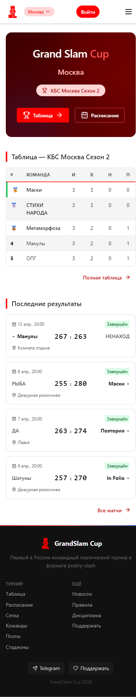 | 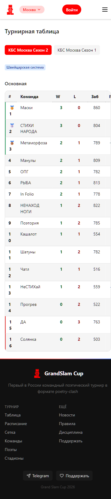 | 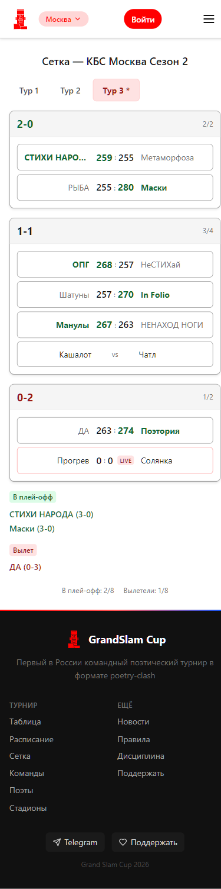 |

| Зрительское голосование                                   | Профиль поэта (с карьерой)                                 | Завершённый матч                                              |
| --------------------------------------------------------- | ---------------------------------------------------------- | ------------------------------------------------------------- |
| 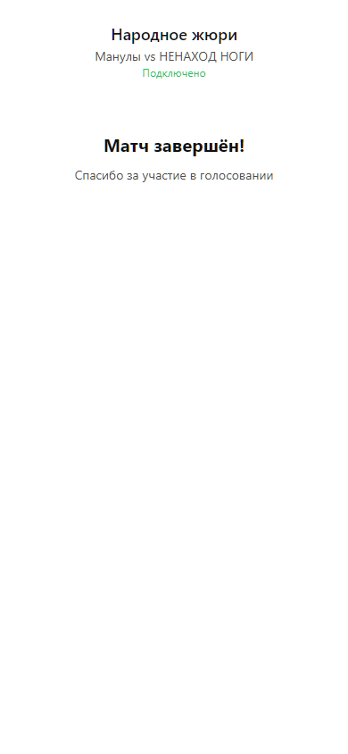 | 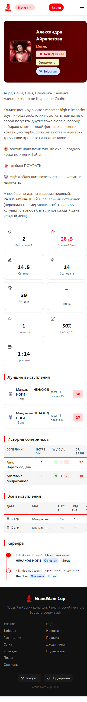 | 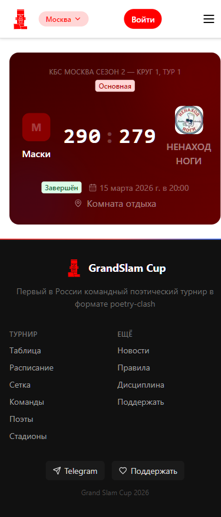 |

| Стихотворение на телефоне                            |
| ---------------------------------------------------- |
| 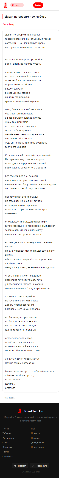 |

---

## Контакты

- **Платформа:** [grandslamcup.letar.best](https://grandslamcup.letar.best)
- **Экосистема Letar:** [letar.best](https://letar.best)
- **Разработчик:** Ками (`kamimidori25@gmail.com`)
- **Демо доступно 24/7** — оргкомитет может зайти в любой момент и потрогать платформу руками.

---

> _Документ актуален на 2026-05-17. Все скриншоты сняты с production-сайта [`grandslamcup.letar.best`](https://grandslamcup.letar.best) — московский сезон 2, реальные команды и поэты. Лежат в [`docs/screenshots/`](./screenshots/): 15 экранов desktop + 6 мобильных. В фокусе — самые насыщенные сущности: матч Маски 290 : 279 НЕНАХОД НОГИ с протоколом, команда «Маски» с историей сезона, поэт Александра Айрапетова с 9 выступлениями._
